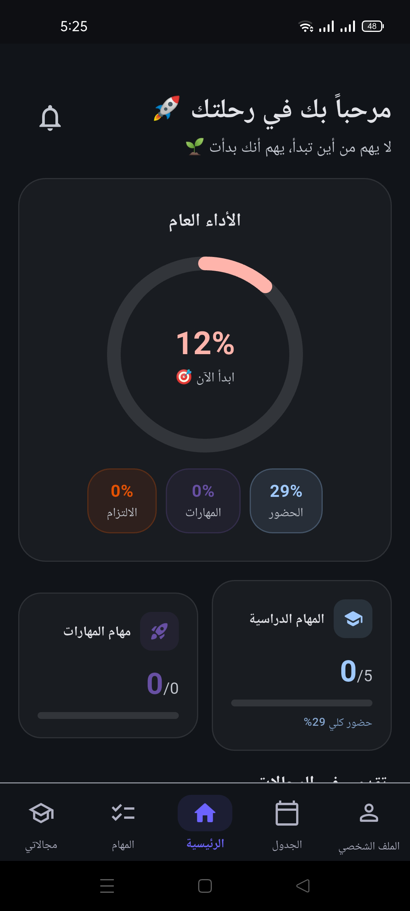
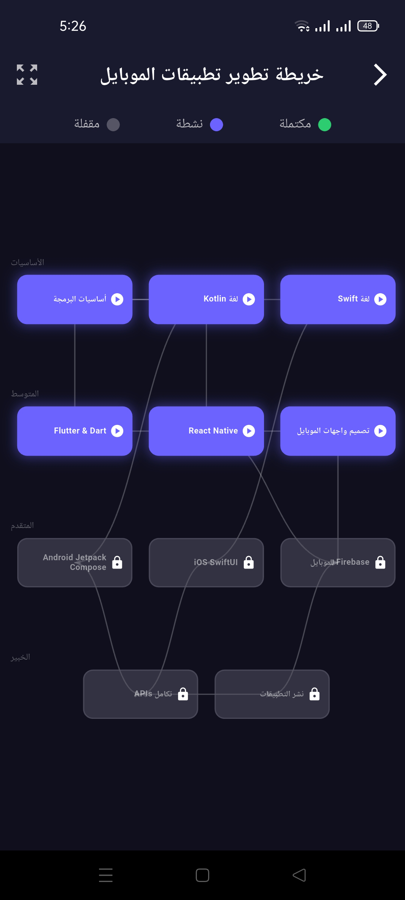
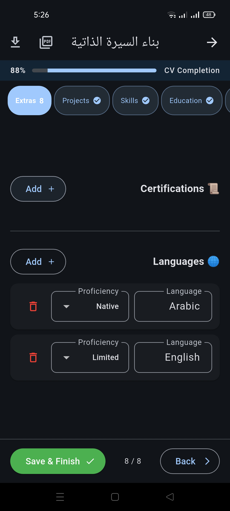
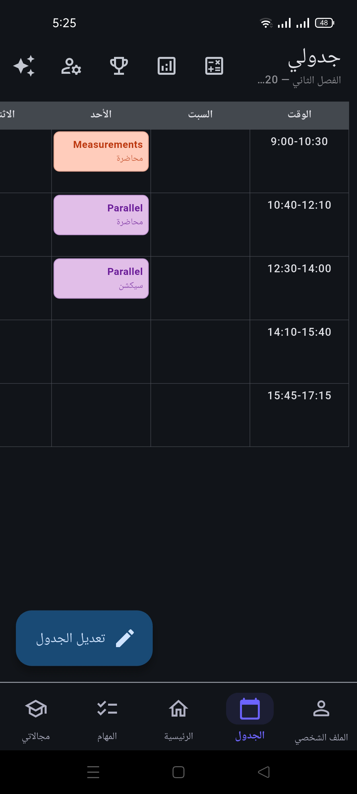

# EDUMATE 📚

> منصة تعليمية هندسية شاملة تساعد الطلاب على تعلم المهارات وإدارة حياتهم الأكاديمية

A comprehensive engineering education platform that helps students learn technical skills, manage their academic schedule, and build their career — all in one place.

---

## ✨ Features

### 🗺️ Learning Roadmaps

- 30 engineering fields with interactive skill maps
- Visual progress tracking from beginner to expert
- Prerequisites system that unlocks skills progressively

### 🎓 Courses

- Thousands of free and paid courses from YouTube, Udemy, and Coursera
- Smart anti-cheat system — lessons unlock only after real watch time
- Course ratings, duration, and enrollment stats

### 🤖 AI Skill Assessment

- Conversational assessments powered by **Gemini 2.0 Flash**
- Minimum 8 questions, up to 15 adaptive questions per skill
- Behavioral integrity tracking: app exits and paste attempts affect the final score
- Weighted scoring: `finalScore = (0.8 × scorePercent + 0.2 × completionScore) - behaviorPenalty`
- Results affect actual progress: pass (≥80%), needs review (50–79%), weak (20–49%), or reset (<20%)
- Max 3 attempts per skill with cooldown: 24h after attempt 1, 48h after attempt 2
- Survey-based starting point: intermediate/advanced users begin at 40%/65% progress

### 📅 Academic Schedule

- Weekly lecture schedule supporting 3 session types: lecture, section, lab
- Attendance tracking with present / late / absent status and understanding ratings
- AI-generated weekly study plan using a priority algorithm based on attendance rate, comprehension, difficulty, and exam proximity
- Smart capacity system: session duration × commitment level determines daily/weekly study limits
- Exam management with GPA calculator (4.0 and 5.0 scales)
- End-of-semester archiving with full stats preserved in `SemesterAchievementRecord`

### 🏆 Gamification

- Points, levels (500 pts/level), streaks, and achievements
- Attendance points: present +10 (bonus +5 for perfect understanding), late +5
- Achievement categories: attendance milestones, understanding streaks, course completion
- Per-semester stats archived at end of semester; `semesterPoints` calculated from delta
- Weekly leaderboard and progress milestones

### 📄 CV Builder

- 8-step guided CV builder: language → personal info → summary → experience → education → skills → projects → certificates & languages
- ATS-compatible PDF export using the `pdf` package (single-column, Helvetica, no images/tables)
- Ready-made ATS-style summary templates
- Drag-and-drop reordering for experience and project cards
- Supports both Arabic (RTL) and English (LTR) CVs
- Auto-saves to Firestore; deleted with account on user removal

### 🔔 Smart Notifications

- Lecture reminders, study session alerts, course inactivity nudges, exam countdowns
- Fully customizable notification preferences tied to survey-defined learning times
- Notification history screen with unread badge count

---

## 🛠️ Tech Stack

| Layer | Technology |
| --- | --- |
| Framework | Flutter (Dart) |
| Backend & Auth | Firebase (Firestore, Authentication, FCM) |
| State Management | Provider + GetX |
| Navigation | GoRouter |
| AI Integration | Google Gemini 2.0 Flash |
| Local Storage | Hive (offline cache) |
| PDF Generation | `pdf` package |
| Sharing | `share_plus` package |

---

## 🚀 Getting Started

### Prerequisites

- Flutter SDK `>=3.0.0`
- Dart SDK `>=3.0.0`
- Java JDK 21 (for Android builds)
- Firebase project with Firestore and Authentication enabled

### Installation

```bash
# 1. Clone the repository
git clone https://github.com/Mohamed-reda-farag/edumate-app.git
cd edumate-app

# 2. Install dependencies
flutter pub get

# 3. Add Firebase config files (not included for security)
#    - android/app/google-services.json
#    - ios/Runner/GoogleService-Info.plist
#    - lib/firebase_options.dart

# 4. Run the app
flutter run
```

> ⚠️ **Note:** Firebase configuration files are excluded from this repository for security reasons. You need to connect your own Firebase project to run the app.

---

## 📁 Project Structure

` ``
lib/
├── controllers/       # State management (Provider + GetX)
├── models/            # Data models
├── repositories/      # Firestore data access layer
├── services/          # Business logic & external services
├── views/             # UI screens
│   ├── auth/          # Login & Sign up
│   ├── dashboard/     # Home & main scaffold
│   ├── skills/        # Learning roadmaps, courses, assessments
│   ├── schedule/      # Academic schedule & study plan
│   ├── tasks/         # Task management
│   ├── cv/            # CV builder
│   ├── profile/       # Settings & user profile
│   └── policy/        # Privacy policy & terms
├── widgets/           # Reusable UI components
└── utils/             # Helper functions
`` `

---

## 📸 Screenshots

|  |  |  |
 |

---

## 🔒 Security

- All user data is protected by Firebase Security Rules (uid-based access)
- Sensitive config files (`google-services.json`, `firebase_options.dart`) are excluded via `.gitignore`
- Passwords are handled exclusively by Firebase Authentication

---

## 🗺️ Roadmap

- [ ] Complete Home Screen
- [ ] Push to Play Store (Beta)
- [ ] Dark mode refinements
- [ ] Offline mode improvements
- [ ] Split `coursesProgress` into a sub-collection (Firestore 1MB doc limit mitigation)
- [ ] Community features

---

## 👨‍💻 Author

"Mohamed Reda"

- 📧 <edumatesupport@gmail.com>
- 🎓 Communications & Computer Engineering Student

---

## 📄 License

This project is currently private and not open for redistribution.
